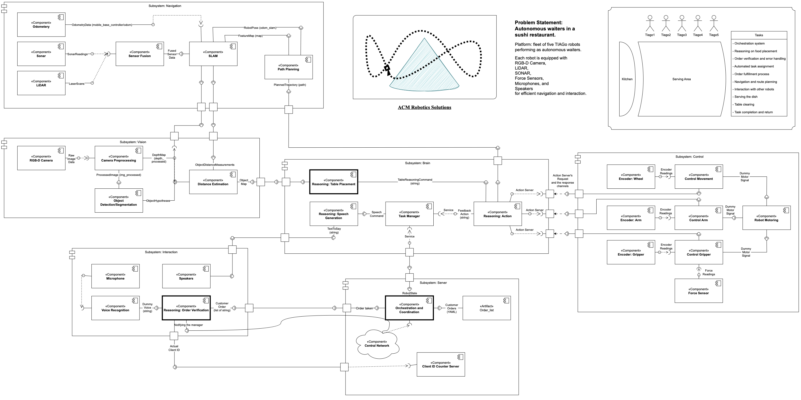

.. _index:

Autonomous Waiters – Complete Project Documentation
===================================================

:Team Name: **ACM Robatics Solution**  
:Contributors: Arian, Milad, Christain 

1. Introduction
---------------

**Problem Statement**  
Busy sushi restaurants lose revenue when diners wait too long or receive the wrong dish.  
Our solution deploys **five PAL Robotics TIAGo robots** to handle order delivery, table clearing,  
and basic customer interaction—freeing staff for tasks that need a human touch.

**Objectives**  

- **Timely delivery**: dispatch the closest available robot, plan obstacle‐free paths, adapt on the fly  

- **Error-free serving**: detect and recover from mis-orders gracefully  

- **Scalability**: coordinate multiple robots without a central bottleneck  

- **Recoverability**: every component is restart-safe; no single point of failure  

2. System Overview
------------------

The software follows a classic **perception → reasoning → actuation** pipeline,  
with a thin orchestration layer balancing the fleet:

.. mermaid::
   :caption: System overview

   graph TD
     A[Orchestration (task_manager.py, orchestration_and_coordination.py)]
     B[Perception (camera.py …)]
     C[Reasoning (path_planning.py, reasoning_action.py …)]
     D[Actuation (control_wheel.py, control_arm.py, control_gripper.py)]
     E[Feedback (encoder_* , force.py , speech_generator.py)]
     A -->|verified order| C
     C -->|path + table cmd| D
     D -->|status| A
     D -->|raw encoders| E
     E -->|status| C

3. Workflow
-----------

#. **Customer speaks** – simulated ASR (`voice_recognition.py`) publishes “Can I have sushi”  
#. **Order verification** – `reasoning_order_verification.py` parses dish names, enqueues via `send_order` service  
#. **Orchestrator** – a free robot polls `/robot_state_decision`, receives the “sushi” task  
#. **ReasoningAction** – `reasoning_action.py` turns the plan + table command into ActionLib goals (move, arm, gripper)  
#. **Execution** – `control_wheel.py`, `control_arm.py`, `control_gripper.py` carry out the motions  
#. **Feedback loop** – upon completion each controller publishes status; `task_manager.py` feeds back into the orchestrator  
#. **Table placement** – after delivery `reasoning_table_placement.py` issues PLACE_DISH or CLEAR_TABLE commands  
#. **Interaction** – `speech_generator.py` & `speaker.py` announce actions to customers  

4. Architectural Diagrams
-------------------------

4.1 Component Diagram

   **Figure X.** High-level component interaction.

4.2 Behavioral Diagram

.. figure:: diagrams/behavioral_diagram.png
   :alt: Behavioral Sequence Diagram
   :align: center

   **Figure Y.** Sequence of messages and actions from order to delivery.

5. Codebase Tour
----------------

Each script is grouped by its pipeline layer.  Click through the API docs for details.

Vision
~~~~~~
- **camera.py**              – static RGB + synthetic depth generator  
- **camera_preprocessing.py** – colour-correction & noise reduction  
- **object_detection.py**     – placeholder object detector (1 Hz)   
- **distance_estimation.py**  – depth-powered object localization  

Brain
~~~~~
- **task_manager.py**       – event aggregator, polls `/robot_state_decision` 
- **reasoning_action.py**           – translates symbolic plans into ActionLib goals  
- **reasoning_table_placement.py**  – maps PLACE/CLEAR decisions to commands  
- **reasoning_speech_generation.py**  – throttles and republishes speech commands at 1 Hz 

Navigation
~~~~~~~~~~
- **path_planning.py**              – dummy global planner (1 waypoint)  
- **slam.py**                       – blank map + identity odom stub  
- **sensor_fusion.py**        – fuse LiDAR + sonar into a single scan  
- **lidar.py**, **sonar.py**  – synthetic LiDAR/sonar streams  

Control
~~~~~~~~~~~~~~~~~~~~~~~~~~~~~
- **control_wheel.py**      – base controller (first waypoint)  
- **control_arm.py**        – proportional joint controller (ActionLib)  
- **control_gripper.py**    – binary gripper actuator (ActionLib)  
- **encoder_wheel.py**, **encoder_arm.py**, **encoder_gripper.py** – synthetic encoders  
- **force.py**              – fake force sensor for manipulator testing  

Interaction
~~~~~~~~~~~
- **speech_generator.py**   – buffers and throttles TTS commands  
- **speaker.py**            – last-mile relay to TTS backend 
- **microphone.py**, **voice_recognition.py** – synthetic ASR pipeline  
- **reasoning_order_verification.py** – validates “Can I have …” orders  

Server
~~~~~~~~~~~~~~~~~~~~~~~~~~~
- **orchestration_and_coordination.py** – YAML-backed order queue + state gateway   

6. Running the System
---------------------

.. code-block:: bash

   # Launch Gazebo, RViz and the full stack
   roslaunch cogar_ws sushi_fleet.launch

   # Alternatively, bring up orchestrator then robot 1
   rosrun cogar_ws orchestration_and_coordination.py &
   roslaunch cogar_ws tiago_bringup.launch robot_id:=1

.. warning::
   A map must exist in ``$(rospack find cogar_ws)/maps/``.  
   Run ``slam.py --save`` on the first layout.

7. Further Reading
------------------
- Detailed component diagrams & behavioral models under each module’s API page  
- Assignment brief slides embedded in ``docs/assets`` for reference  

.. rubric:: Contents

.. toctree::
   :maxdepth: 1
   :caption: Contents

   vision
   vision/vision_modules/camera
   vision/vision_modules/camera_preprocessing
   vision/vision_modules/object_detection
   vision/vision_modules/distance_estimation
   brain
   brain/brain_modules/reasoning_action
   brain/brain_modules/reasoning_table_placement
   brain/brain_modules/reasoning_speech_generation
   brain/brain_modules/task_manager
   navigation
   navigation/navigation_modules/sonar
   navigation/navigation_modules/lidar
   navigation/navigation_modules/sensor_fusion
   navigation/navigation_modules/slam
   navigation/navigation_modules/path_planning
   control
   control/control_modules/control_wheel
   control/control_modules/control_arm
   control/control_modules/control_gripper
   control/control_modules/encoder_wheel
   control/control_modules/encoder_arm
   control/control_modules/encoder_gripper
   control/control_modules/force
   interaction
   interaction/interaction_modules/voice_recognition
   interaction/interaction_modules/microphone
   interaction/interaction_modules/reasoning_order_verification
   interaction/interaction_modules/speaker
   server
   server/server_modules/orchestration_and_coordination