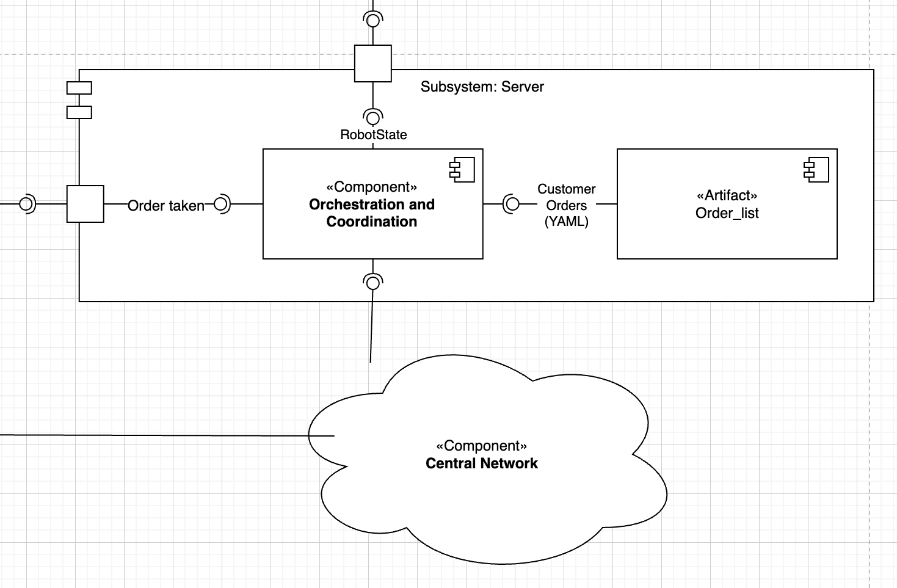

=============================
Subsystem Server
=============================

Role in the architecture
------------------------
While each TIAGo executes its own navigation and manipulation stack, **one
central server** coordinates the *workflow*:

* stores every verified customer order in a **persistent FIFO queue**,
* assigns the next order to whichever robot reports the state **Free** or
  **Wait**,
* returns a “Busy → order list” transition so the robot can start execution.

The logic lives in a single script,
:pyfile:`orchestration_and_coordination.py`.

ROS interfaces & KPIs
---------------------
.. list-table::
   :header-rows: 1
   :widths: 35 25 40

   * - Service / Topic
     - Type
     - KPI / Note
   * - ``/robot_state_decision`` (srv)
     - ``tiago1/robotstatedecision``
     - 99.9 % success, response < 100 ms, *Busy* → order size ≥ 1
   * - ``/robot_state_decision_add`` (srv)
     - ``tiago1/send_order``
     - Writes to YAML within 50 ms, handles 20 requests / s
   * - ``tiago_data.yaml`` (file I/O)
     - YAML
     - Survives restart, corrupt file recovery < 1 s

Data life-cycle
~~~~~~~~~~~~~~~
#. **Order added** – verification node calls
   ``/robot_state_decision_add``.  
#. **Server saves** the new entry to *tiago_data.yaml* and logs
   *“order added”*.  
#. A robot reports *Free* ➜ server pops the queue and returns the task with
   state *Busy*.  
#. When all robots report *Busy* and the queue empties, new robots receive the
   response *Wait* until a fresh order arrives.

Implementation module
---------------------
Full API documentation:

.. toctree::
   :maxdepth: 1
   :caption: Server Component

   server_modules/orchestration_and_coordination
